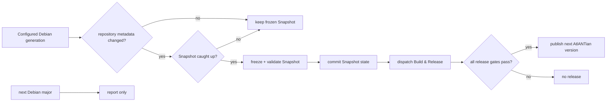

# Debian lifecycle

This document owns AtlANTian's Debian-generation and Debian Snapshot automation.
User-facing platform upgrades are documented in [Upgrading](UPGRADING.md);
release/version mechanics are documented in [Pipeline](PIPELINE.md).

## Policy

| Rule | Behavior |
|---|---|
| Architecture | configured Debian generation must still publish `armhf` |
| Factory input | exact Debian Snapshot metadata is frozen |
| Runtime repositories | installed codename is fixed; moving `stable` is never used |
| Routine Debian change | refresh the frozen Snapshot, then build/verify/publish a new AtlANTian release |
| New Debian major | report availability only; transition remains explicit |
| Failure | keep the last verified Snapshot and configured generation |

A routine Snapshot refresh changes the reproducible factory baseline. Because the
published image changes, it produces the next release number in the current
AtlANTian release line after the full release gates pass. The Snapshot timestamp
is still recorded separately from the semantic version.

## Daily watcher

`Debian Base Watch` runs daily at **06:17 Asia/Tomsk**:

1. read the configured Debian major/codename;
2. verify `armhf` availability in main, updates and security;
3. compare live Release metadata with the frozen checksums;
4. if metadata changed, wait until Debian Snapshot contains those exact bytes;
5. write the new Snapshot timestamp/checksums;
6. validate the frozen inputs;
7. commit only Snapshot state;
8. explicitly dispatch `Build & Release` with `origin=debian-watch`;
9. after full build/validation gates pass, publish the next automatic AtlANTian
   version;
10. separately report when the immediate next Debian major becomes available.

The explicit dispatch is required because a workflow push made with
`GITHUB_TOKEN` does not recursively trigger the normal push release workflow.

If the runner's `debootstrap` package does not yet know the configured codename,
AtlANTian uses Debian's generic bootstrap script while still targeting the pinned
codename and Snapshot.

> [!IMPORTANT]
> If Debian drops `armhf`, AtlANTian fails closed on the configured generation
> instead of silently moving to an incompatible base.

## Factory baseline vs running system

| Factory image | Installed board |
|---|---|
| immutable Snapshot baseline | live repositories for the installed codename |
| reproducible package set | normal security/package maintenance |
| exact Snapshot recorded in metadata | `apt upgrade` does not change AtlANTian release identity |

`apt update`/`apt upgrade` update the running Debian userspace. They do not
themselves create an AtlANTian release or change Debian major.

## Debian-major transition

A Debian-major transition changes the **first component** of the AtlANTian release
line and is an intentional platform change. Automation may report Debian `N+1`,
but it never edits `DEBIAN_MAJOR`, `DEBIAN_CODENAME` or initiates the transition.

**SD:** once a compatible next-major AtlANTian release exists,
`atlantian-sysupgrade` supports only `N → N+1`, stages resumable state and handles
managed APT sources.

**NAND:** cross-major rebasing is intentionally not supported. Boot the
next-major unified SD image, perform a clean NAND installation, then restore only
known-compatible application/user data and reinstall required packages.

See [Upgrading](UPGRADING.md) for operator steps.

## Watcher maintenance

Snapshot lag and partially published Debian metadata are retried without modifying
the configured release generation. If the public repository has no commit for
45 days, the watcher may create one empty maintenance commit solely to keep
GitHub's scheduled workflow active; it does not alter release inputs and does not
trigger `Build & Release`.
