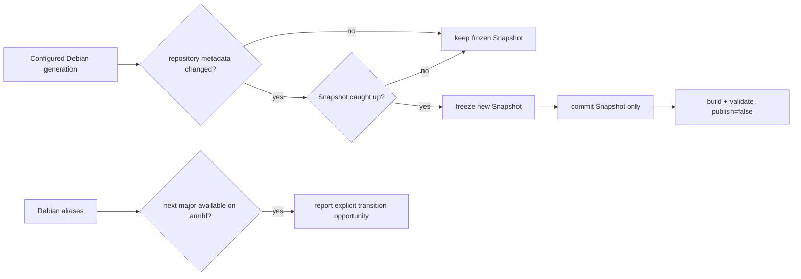

# Debian lifecycle

AtlANTian tracks the configured Debian generation while keeping factory images
reproducible and preventing automated release/version drift.

## Policy

| Rule | Behavior |
|---|---|
| Architecture | `armhf` must still be published by Debian |
| Factory input | exact Debian Snapshot metadata is frozen |
| Runtime repositories | fixed installed codename, never moving `stable` |
| AtlANTian release | `<Debian major>.<AtlANTian minor>.<AtlANTian patch>[-prerelease]` |
| Routine Debian refresh | updates Snapshot pins only; never changes AtlANTian version |
| New Debian major | detected and reported; transition is an explicit release-line decision |
| Failure | keep the last verified Snapshot and configured generation |

## Daily watcher

At **06:17 Asia/Tomsk** automation:

1. reads the currently configured Debian major/codename;
2. verifies `armhf` in main, updates and security;
3. compares live Release metadata with the frozen checksums;
4. if Debian changed, waits until Snapshot contains those exact bytes;
5. freezes the new Snapshot timestamp/checksums;
6. commits only Snapshot state;
7. dispatches `Build & Release` with `publish=false` for full validation;
8. separately reports when the immediate next Debian major becomes available.

A routine Snapshot refresh does **not** modify `config/release.env` or create a
new semantic release. The exact Snapshot timestamp is recorded separately in
runtime/release metadata.

If the runner's `debootstrap` package does not yet know a configured codename,
AtlANTian uses Debian's generic bootstrap script while still targeting the pinned
codename and Snapshot.

> [!IMPORTANT]
> If Debian drops `armhf`, AtlANTian fails closed on the configured generation
> instead of silently moving to an incompatible base.

## Factory vs running system

| Factory image | Installed board |
|---|---|
| immutable Snapshot baseline | live same-codename Debian repositories |
| reproducible package set | normal security/package maintenance |
| semantic AtlANTian release + Snapshot identity | release remains unchanged by ordinary `apt upgrade` |

Normal `apt upgrade` never changes the Debian codename or AtlANTian release.

## Major transitions

A Debian-major transition changes the **first component** of the AtlANTian release
line and is reviewed as an intentional platform transition. Automation may report
Debian `N+1`, but it never edits `DEBIAN_MAJOR`, `DEBIAN_CODENAME` or the AtlANTian
release number by itself.

**SD:** after an explicit next-major AtlANTian release exists,
`atlantian-release-check` prefers a same-major bridge release when needed;
`atlantian-sysupgrade` handles only `N → N+1`, backs up/disables third-party APT
sources for the transition, switches managed repositories, performs Debian's
major upgrade and keeps resumable state.

**NAND:** the immutable lower and application state are not automatically rebased
across Debian majors. Boot the next-major unified SD image, perform a clean NAND
install, then transfer only known-compatible user/application data and reinstall
required packages.

Operator procedure and recovery details belong in [Upgrading](UPGRADING.md).

## Automation recovery

Snapshot lag and partially published repository metadata are retried without
changing the configured release. If the repository itself has had no commit for
45 days, the watcher emits one empty maintenance commit to keep scheduled checks
active without carrying a tracked heartbeat-state file. External Debian changes
outside the validated contract fail closed and require explicit maintenance
rather than an inferred transition.
