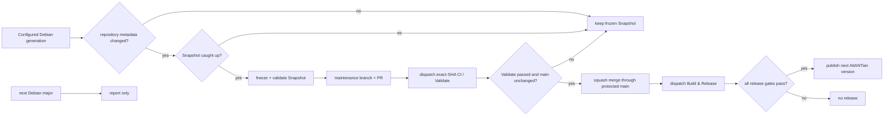

# Debian lifecycle

This document owns AtlANTian's Debian-generation and Debian Snapshot automation.
User-facing platform upgrades are documented in [Upgrading](UPGRADING.md);
release/version mechanics are documented in [Pipeline](PIPELINE.md).

## Policy

| Rule | Behavior |
|---|---|
| Architecture | configured Debian generation must still publish `armhf` |
| Factory input | exact Debian Snapshot metadata is frozen |
| Runtime repositories | installed codename is fixed; moving `stable` is never used |
| Routine Debian change | refresh the frozen Snapshot, validate it through protected `main`, then build/verify/publish a new AtlANTian release |
| New Debian major | report availability only; transition remains explicit |
| Failure | keep the last verified Snapshot and configured generation |

A routine Snapshot refresh changes the reproducible factory baseline. Because the
published image changes, it produces the next release number in the current
AtlANTian release line after the full release gates pass. The Snapshot timestamp
is still recorded separately from the semantic version.

## Daily watcher

`Debian Base Watch` runs daily at **06:17 Asia/Tomsk**. It also runs once when its
own protected-maintenance plumbing changes so that CI/branch-protection changes
are exercised immediately instead of waiting for the next day.

The watcher:

1. reads the configured Debian major/codename;
2. verifies `armhf` availability in main, updates and security;
3. compares live Release metadata with the frozen checksums;
4. if metadata changed, waits until Debian Snapshot contains those exact bytes;
5. writes the new Snapshot timestamp/checksums in the runner worktree;
6. validates the frozen inputs;
7. creates one short-lived `maintenance/debian-snapshot-*` branch and pull request;
8. explicitly dispatches the normal `CI / Validate` job for the exact base/head
   SHAs and waits for success;
9. verifies that `main` did not move while validation was running, then
   squash-merges the pull request through GitHub's protected-branch merge API;
10. verifies the resulting protected `main` SHA and explicitly dispatches
    `Build & Release` with `origin=debian-watch`;
11. after the full build/validation gates pass, publishes the next automatic
    AtlANTian version;
12. separately reports when the immediate next Debian major becomes available.

The PR/Validate/squash path is intentional. `main` requires pull requests and the
`Validate` status check, so scheduled maintenance never receives a branch-protection
bypass and never pushes directly to `main`.

The explicit CI dispatch is also intentional: events created by the workflow's
`GITHUB_TOKEN` do not recursively start the normal `pull_request` workflow. The
watcher therefore dispatches `ci.yml` itself on the exact maintenance head SHA.
Likewise, after the verified squash merge it explicitly dispatches `Build & Release`
because a `GITHUB_TOKEN` merge does not recursively trigger the normal push release
workflow.

If the runner's `debootstrap` package does not yet know the configured codename,
AtlANTian uses Debian's generic bootstrap script while still targeting the pinned
codename and Snapshot.

> [!IMPORTANT]
> If Debian drops `armhf`, AtlANTian fails closed on the configured generation
> instead of silently moving to an incompatible base.

## Factory baseline vs running system

| Factory image | Installed board |
|---|---|
| immutable Snapshot baseline | live repositories for the installed codename |
| reproducible package set | normal security/package maintenance |
| exact Snapshot recorded in metadata | `apt upgrade` does not change AtlANTian release identity |

`apt update`/`apt upgrade` update the running Debian userspace. They do not
themselves create an AtlANTian release or change Debian major.

## Debian-major transition

A Debian-major transition changes the **first component** of the AtlANTian release
line and is an intentional platform change. Automation may report Debian `N+1`,
but it never edits `DEBIAN_MAJOR`, `DEBIAN_CODENAME` or initiates the transition.

**SD:** once a compatible next-major AtlANTian release exists,
`atlantian-sysupgrade` supports only `N → N+1`, stages resumable state and handles
managed APT sources.

**NAND:** cross-major rebasing is intentionally not supported. Boot the
next-major unified SD image, perform a clean NAND installation, then restore only
known-compatible application/user data and reinstall required packages.

See [Upgrading](UPGRADING.md) for operator steps.

## Watcher maintenance

Snapshot lag and partially published Debian metadata are retried without modifying
the configured release generation. If the public repository has no commit for
45 days, the watcher may create one empty maintenance commit solely to keep
GitHub's scheduled workflow active. The heartbeat uses the **same** temporary
maintenance branch → exact-SHA `Validate` → protected squash-merge path as a real
Snapshot refresh; it never pushes directly to `main`, does not alter release
inputs and does not dispatch `Build & Release`.
